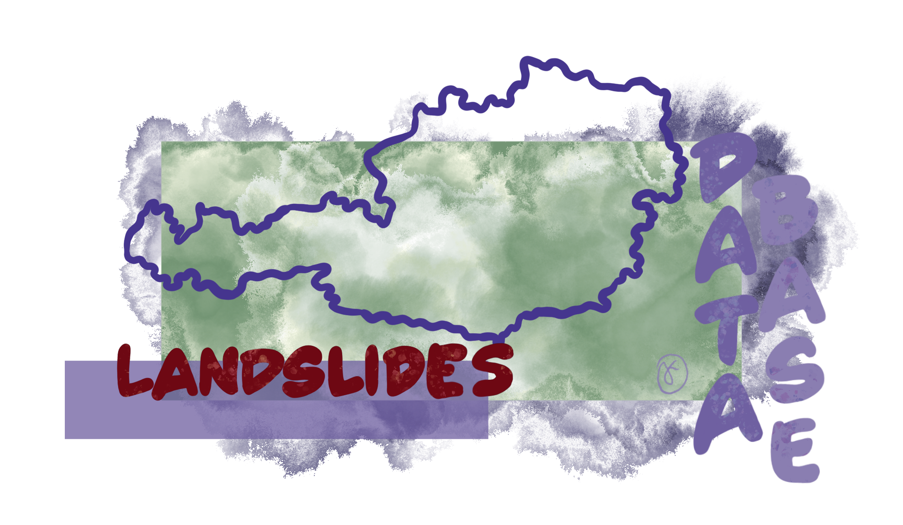

  

# Austrian Landslide Inventory

This project aims to build the most comprehensive, open-source landslide 
data base for Austria. The data base encompasses different mass movement 
phenomena (see [Classifications](#classifications) for more info).

By consolidating data from various national and international sources, we 
provide a PostGIS database that can be easily setup using Docker.

> [!WARNING]
> This project is under active development. The database schema and its records
> are subject to change.

> [!TIP]
> For quick access without setting up the data base, a GeoPackage dump is 
> available. It contains a single table of the events and is located in the
> [`db-dump/`](./db-dump/) directory.

## Getting Started

To get your own instance of the database up and running, please follow the 
setup instructions which use Docker for easy deployment.

Please refer to the [**Database Setup Guide**](./alembic/README.md).

## Data Sources

The inventory is built by incorporating data from the following sources:

- [GeoSphere](https://data.inspire.gv.at/d69f276f-24b4-4c16-aed7-349135921fa1):
    CC BY 4.0 ([link](https://creativecommons.org/licenses/by/4.0/))
- [Global Fatal Landslides](https://www.arcgis.com/home/item.html?id=7c9397b261aa436ebfbc41396bd96d06):
    Open Government License ([link](https://www.nationalarchives.gov.uk/doc/open-government-licence/version/2/))
- [NASA COOLR](https://maps.nccs.nasa.gov/arcgis/apps/MapAndAppGallery/index.html?appid=574f26408683485799d02e857e5d9521): 
    Custom License ([link](./data/raw/nasa-coolr/LICENSE))
- [WLV](https://geometadatensuche.inspire.gv.at/metadatensuche/inspire/ger/catalog.search#/metadata/ccca05aa-728d-4218-9f4c-81286c537527)
    No Limitations ([link](https://geometadatensuche.inspire.gv.at/metadatensuche/inspire/ger/catalog.search#/metadata/ccca05aa-728d-4218-9f4c-81286c537527))

> [!NOTE]
> Each record in the database is linked to its original source to ensure clear
> data provenance and proper attribution.

We are continuously working on adding more data sources to enhance the
comprehensiveness of the inventory.

## Classifications

The database stores a classification for each event and includes multiple types
of mass-movement phenomena, **not only landslides**. Types present include:

- gravity slide or flow
- rockfall
- mass movement (undefined)
- deep‑seated rock slope deformation
- collapse / sinkhole

See the classification table in the database for the set of types.

## Contributing

Contributions are always welcome! 😊
Please refer to the [**Contribution Guidelines**](./CONTRIBUTING.md) for more
details on how to setup your development environment.
